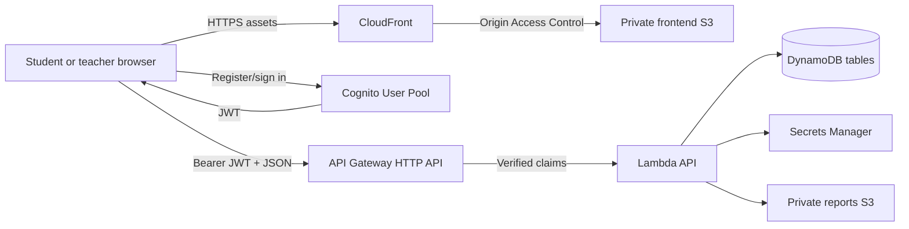
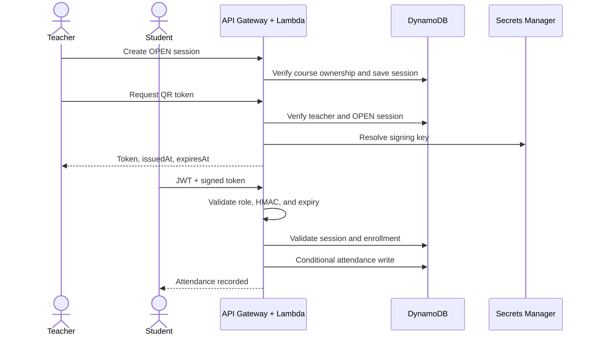

# CloudAttend

CloudAttend is a serverless university attendance-management application built for AWS. Teachers create courses and time-limited attendance sessions; students authenticate through Amazon Cognito and submit a cryptographically signed QR token. Before recording attendance, the API independently verifies the caller's identity and role, token signature and expiry, session state, course enrollment, and duplicate status.

This npm-workspaces monorepo contains a React frontend, TypeScript Lambda API, shared Zod contracts, AWS CDK infrastructure, tests, deployment utilities, and documentation.

> **Current status:** the repository contains a deployable, verified attendance core, but not every planned production feature. The exact implemented API and remaining work are documented below. Reporting, analytics, user-provisioning triggers/scripts, camera scanning, frontend tests, CI, and deployed smoke tests remain unfinished; the repository is therefore not tagged `v1.0.0`.

## Contents

- [Implemented features](#implemented-features)
- [Technology stack](#technology-stack)
- [AWS services](#aws-services)
- [Architecture](#architecture)
- [Repository structure](#repository-structure)
- [Prerequisites and installation](#prerequisites-and-installation)
- [Frontend runtime configuration](#frontend-runtime-configuration)
- [Local development](#local-development)
- [Checks, tests, and builds](#checks-tests-and-builds)
- [AWS credentials and CDK bootstrap](#aws-credentials-and-cdk-bootstrap)
- [Deployment](#deployment)
- [Authentication and authorization](#authentication-and-authorization)
- [Secure QR attendance flow](#secure-qr-attendance-flow)
- [API reference](#api-reference)
- [Database design](#database-design)
- [Security](#security)
- [Production and teardown](#production-and-teardown)
- [Troubleshooting](#troubleshooting)
- [Git workflow](#git-workflow)
- [Known gaps](#known-gaps)

## Implemented features

### Identity and access

- Cognito User Pool with email sign-in and email confirmation.
- Public student registration UI with name, email, password, and university roll number.
- Browser App Client without a client secret.
- `STUDENT` and `TEACHER` Cognito groups.
- API Gateway JWT authorization for protected routes.
- Lambda-side role checks; frontend route protection is never the only authorization layer.
- Teacher ownership checks before course or session mutation.

### Courses, sessions, and attendance

- Teachers can create, list, and update their own courses.
- Owning teachers can view a course roster and enroll a registered student.
- Teachers can start and close attendance sessions.
- Open sessions issue HMAC-SHA-256 signed QR tokens with a 45-second lifetime.
- Students check in without sending a trusted `studentId`, `teacherId`, or separate `courseId`.
- The API checks enrollment, session state and time window, token integrity/expiry, and token/session consistency.
- Attendance uses a DynamoDB conditional write to reject duplicate check-ins atomically.
- API errors have stable codes/messages and do not expose stack traces.

### Frontend and infrastructure

- Responsive React/Vite UI for registration, confirmation, sign-in/out, course listing, starting/closing sessions, QR display, and URL-token check-in.
- Private S3 frontend bucket delivered through CloudFront Origin Access Control.
- Private S3 report bucket ready for the future report API.
- Five on-demand DynamoDB tables with purpose-built GSIs.
- Secrets Manager-generated QR signing key.
- CDK development and production contexts with safer production retention settings.
- Project/environment/management tags applied through CDK.

## Technology stack

| Layer | Technology | Purpose |
|---|---|---|
| Language | Strict TypeScript | Frontend, backend, shared contracts, scripts, infrastructure |
| Monorepo | npm workspaces | Workspace installation and root commands |
| Frontend | React 19, Vite 6 | Browser application and optimized bundle |
| Routing | React Router | Client-side pages and QR deep links |
| Server state | TanStack Query | API loading, caching, and error state |
| Authentication | AWS Amplify Auth | Cognito registration, confirmation, sessions, sign-in/out |
| Validation | Zod | Shared runtime request validation |
| Forms | React Hook Form | Form foundation |
| QR | `qrcode.react`, `@zxing/browser` | Rendering; ZXing is installed for the unfinished camera scanner |
| Backend | AWS Lambda, AWS SDK v3 | Stateless API and AWS data adapters |
| API | API Gateway HTTP API | HTTPS routing, JWT authorizer, payload format 2.0 |
| Database | DynamoDB | Users, courses, enrollments, sessions, attendance |
| Storage/CDN | S3 and CloudFront | Private frontend/report storage and public HTTPS delivery |
| Secrets | Secrets Manager | Generated QR HMAC material |
| Infrastructure | AWS CDK v2 / CloudFormation | Reproducible AWS resources and permissions |
| Tests | Vitest | Backend unit tests |
| Quality | ESLint, TypeScript | Static analysis and strict checking |

Development requires Node.js 24+. The application Lambda currently uses CDK's `nodejs22.x` runtime declaration in [cloudattend-stack.ts](infra/lib/cloudattend-stack.ts); CDK-managed support functions may use the runtime selected by the installed CDK release.

## AWS services

### Amazon Cognito

Cognito stores credentials, verifies email addresses, and issues JWTs. The public browser client has no secret because browser applications cannot safely hold one. Public users cannot select a teacher role; teacher membership is administrative.

The intended post-confirmation Lambda is not yet attached. On a fresh stack, confirmed users still require a Users-table record and correct Cognito group membership before protected application flows work completely.

### API Gateway HTTP API

API Gateway exposes HTTPS routes and validates Cognito JWT issuer/audience data. `GET /health` is public; the catch-all application integration uses the JWT authorizer. Lambda performs authorization again using verified claims.

### AWS Lambda

One bundled TypeScript function currently dispatches API Gateway v2 events. It uses AWS SDK v3 DynamoDB document commands. Splitting it into smaller functions would allow even narrower IAM permissions as the API grows.

### Amazon DynamoDB

Five on-demand tables store application data. GSIs support email/roll lookup, courses by teacher, courses by student, sessions by course, and attendance by course. Normal access paths use point reads and queries rather than unrestricted scans.

### AWS Secrets Manager

CDK generates a 64-character QR signing secret. The signing material is never shipped to the frontend or returned by an API. Lambda receives a CloudFormation Secrets Manager dynamic reference. Rotating this key invalidates QR tokens signed with the previous key.

### Amazon S3 and CloudFront

The frontend and reports buckets block public access, enforce TLS, and use S3-managed encryption. CloudFront uses Origin Access Control to read the private frontend bucket, redirects viewers to HTTPS, and maps S3 403 responses to `/index.html` for React routes. The report API is not yet implemented.

### IAM and CloudFormation

CDK grants the API Lambda access to the application tables, report bucket, and QR secret without attaching AdministratorAccess. CDK synthesizes CloudFormation, which owns resource creation, updates, outputs, and removal behavior.

## Architecture



The browser is not a trust boundary. Identity comes from the JWT, roles come from Cognito groups, and ownership/enrollment/session state come from DynamoDB.

### Attendance sequence



The compact architecture reference is in [docs/architecture.md](docs/architecture.md).

## Repository structure

```text
cloudattend/
├── apps/
│   ├── api/
│   │   ├── src/core.ts          # Routing, validation, authorization, QR rules
│   │   ├── src/handler.ts       # AWS SDK adapter and Lambda entry
│   │   └── tests/core.test.ts   # QR and conditional-write tests
│   └── web/
│       ├── src/main.tsx         # React routes and implemented flows
│       ├── src/styles.css       # Responsive application styling
│       └── vite.config.ts
├── packages/shared/src/index.ts # Shared Zod schemas, types, constants
├── infra/
│   ├── bin/cloudattend.ts       # CDK app entry
│   ├── lib/cloudattend-stack.ts # AWS resources, IAM grants, outputs
│   └── cdk.json
├── scripts/
│   ├── check-secrets.mjs
│   ├── deploy.ts
│   └── generate-web-config.ts
├── docs/
│   ├── architecture.md
│   ├── api.md
│   ├── database.md
│   └── git-workflow.md
├── .env.example
├── package.json
└── tsconfig.base.json
```

## Prerequisites and installation

Install:

1. Node.js 24 or newer (`node --version`).
2. npm 11 or newer (`npm --version`).
3. Git.
4. AWS CLI v2 for deployment.
5. An AWS account and a bootstrapped target region.

Clone and install from the repository root:

```bash
git clone <repository-url>
cd cloudattend
npm install
```

Use `npm ci` for repeatable CI-style installation when the lockfile is unchanged. Do not install each workspace separately; the root command links all internal packages.

AWS deployment can incur charges. Review the synthesized template and current AWS pricing before deployment.

## Frontend runtime configuration

The frontend loads `/config.json` at startup rather than compiling AWS identifiers into source code. The file is deployment-specific and ignored by Git.

```json
{
  "region": "us-east-1",
  "apiUrl": "https://example.execute-api.us-east-1.amazonaws.com",
  "userPoolId": "us-east-1_example",
  "userPoolClientId": "exampleclientid"
}
```

After CDK deployment creates `infra/cdk-outputs.json`, generate it with:

```bash
AWS_REGION=us-east-1 npx tsx scripts/generate-web-config.ts infra/cdk-outputs.json
```

This writes `apps/web/public/config.json`. For local development against an existing dev stack, create or generate that file before starting Vite. These IDs/URLs are public browser configuration; never put passwords, tokens, access keys, or the QR signing secret in it.

## Local development

CloudAttend uses a deployed dev AWS backend instead of fake local Cognito/DynamoDB replacements.

```bash
npm install
npm run dev
```

Vite normally prints `http://localhost:5173`. Ensure `apps/web/public/config.json` points to the intended development stack. The browser then talks directly to Cognito and the configured API.

## Checks, tests, and builds

Run all commands from the repository root.

```bash
npm run lint          # ESLint in every workspace
npm run typecheck     # strict TypeScript checks
npm run test          # all defined workspace tests
npm run test:api      # API unit tests only
npm run build         # API, web, shared package, and infrastructure builds
npm run cdk:synth     # Lambda bundle + CloudFormation synthesis
npm run check:secrets # tracked-file/path secret scan
```

The current API suite tests valid tokens, modified-token rejection, expiration, and conditional duplicate writes. The root `test:web` command exists, but the web workspace does not yet define tests.

Run the complete current verification sequence with:

```bash
npm install
npm run lint
npm run typecheck
npm run test
npm run build
npm run cdk:synth
npm run check:secrets
```

Build output is written beneath workspace `dist/` directories. CDK output is written to `cdk.out/`. These generated paths are ignored by Git.

## AWS credentials and CDK bootstrap

Never paste AWS keys into source files. Prefer IAM Identity Center or an AWS named profile.

```bash
aws configure sso --profile cloudattend-dev
aws sso login --profile cloudattend-dev
export AWS_PROFILE=cloudattend-dev
export AWS_REGION=us-east-1
export AWS_DEFAULT_REGION=us-east-1
aws sts get-caller-identity
```

For a standard profile, use `aws configure --profile cloudattend-dev` instead. Confirm the returned account before any deployment.

Bootstrap each account/region once:

```bash
npx cdk bootstrap aws://ACCOUNT_ID/us-east-1 --profile cloudattend-dev
```

Synthesize without deploying:

```bash
npm run cdk:synth
```

To inspect production settings:

```bash
npx cdk synth --app "npx tsx infra/bin/cloudattend.ts" --context environment=prod
```

## Deployment

The helper validates, deploys infrastructure, captures outputs, generates browser configuration, and builds the frontend:

```bash
npx tsx scripts/deploy.ts dev
```

It runs lint, type checking, tests, synthesis, CDK deployment, config generation, and the Vite production build. The current helper does **not** upload the frontend or invalidate CloudFront automatically. After it finishes, read `FrontendBucket` and `DistributionId` from `infra/cdk-outputs.json` and run:

```bash
aws s3 sync apps/web/dist/ s3://FRONTEND_BUCKET --delete --profile cloudattend-dev
aws cloudfront create-invalidation \
  --distribution-id DISTRIBUTION_ID \
  --paths "/*" \
  --profile cloudattend-dev
```

The final site address is the `CloudFrontUrl` output. A new distribution can take several minutes to become globally available.

### Manual deployment

```bash
npx cdk deploy \
  --app "npx tsx infra/bin/cloudattend.ts" \
  --context environment=dev \
  --outputs-file infra/cdk-outputs.json \
  --profile cloudattend-dev

AWS_REGION=us-east-1 npx tsx scripts/generate-web-config.ts infra/cdk-outputs.json
npm --workspace @cloudattend/web run build
```

CDK emits these outputs:

| Output | Use |
|---|---|
| `ApiUrl` | HTTP API base URL |
| `CloudFrontUrl` | Public application URL |
| `UserPoolId` | Cognito User Pool ID |
| `UserPoolClientId` | Browser client ID |
| `FrontendBucket` | S3 deployment destination |
| `DistributionId` | CloudFront cache invalidation target |

## Authentication and authorization

Registration sends email, password, name, and `custom:rollNo` to Cognito. Cognito sends an email code, and the confirmation UI confirms the account.

The intended complete flow then adds the user to `STUDENT` and creates its Users-table record through a post-confirmation trigger. That trigger is not implemented yet, so fresh-stack users require an administrative group assignment and Users record.

Teacher accounts must never come from public role selection. They should be created by an administrative script that creates/confirms the user, assigns `TEACHER`, and writes Users. That script remains unfinished.

For protected API calls, API Gateway verifies the JWT issuer/audience. Lambda derives the user ID from `sub`, reads `cognito:groups`, checks the required role, and verifies resource ownership. Browser-supplied role and identity values are not trusted.

## Secure QR attendance flow

Tokens use this format:

```text
base64url(JSON payload).base64url(HMAC-SHA-256 signature)
```

Conceptual payload:

```json
{
  "sessionId": "uuid",
  "courseId": "uuid",
  "iat": 1791110000,
  "exp": 1791110045,
  "jti": "uuid"
}
```

Check-in performs these server-side checks:

1. API Gateway validates the JWT.
2. Lambda requires `STUDENT` membership.
3. Zod validates the request.
4. Lambda verifies the HMAC using timing-safe comparison.
5. The token must not be expired.
6. The referenced session must exist and be `OPEN`.
7. The scheduled attendance window must still be active.
8. Signed course and stored session must match.
9. The authenticated student must be enrolled.
10. A conditional DynamoDB write must succeed.

This protects against payload modification, forged session IDs, expired screenshots, unenrolled attendance, teacher-API access by students, and duplicate check-ins. CloudAttend does not use invasive fingerprinting or require location access.

## API reference

All protected calls require `Authorization: Bearer <Cognito JWT>`. Errors use:

```json
{
  "error": {
    "code": "SESSION_CLOSED",
    "message": "This attendance session has closed."
  }
}
```

| Method | Endpoint | Role | Current behavior |
|---|---|---|---|
| GET | `/health` | Public | Returns `{ "status": "ok" }` |
| GET | `/me` | Authenticated | Returns Users record for JWT subject |
| POST | `/courses` | Teacher | Creates a course; teacher comes from JWT |
| GET | `/courses` | Authenticated | Teacher courses or student enrollment records |
| PUT | `/courses/{courseId}` | Owning teacher | Partially updates a course |
| GET | `/courses/{courseId}/students` | Owning teacher | Returns enrollment records |
| POST | `/courses/{courseId}/students` | Owning teacher | Enrolls a Users-table student |
| DELETE | `/courses/{courseId}/students/{studentId}` | Owning teacher | Recognized but currently returns 501 |
| POST | `/courses/{courseId}/sessions` | Owning teacher | Starts a 1–180 minute session |
| GET | `/sessions/{sessionId}/qr-token` | Owning teacher | Returns signed 45-second token; no-store |
| POST | `/sessions/{sessionId}/close` | Owning teacher | Closes session and records actual end |
| POST | `/attendance/check-in` | Student | Validates token/session/enrollment and writes attendance |

Example course body:

```json
{
  "courseCode": "CS401",
  "courseName": "Cloud Computing",
  "semester": "Fall 2026",
  "section": "A",
  "attendanceThreshold": 75
}
```

Start a session with `{ "durationMinutes": 10 }`. Check in with `{ "token": "signed-token" }`. The body never includes a trusted student or teacher ID. See [docs/api.md](docs/api.md) for the compact reference.

## Database design

All timestamps use UTC ISO 8601 strings. Tables use on-demand billing.

| Table | Primary key | GSIs | Main access patterns |
|---|---|---|---|
| Users | `userId` | `email-index`, `rollNo-index` | Identity and administrative lookup |
| Courses | `courseId` | `teacherId-index` | Course by ID, teacher's courses |
| Enrollments | `courseId` + `studentId` | `studentId-index` (`studentId` + `courseId`) | Roster, membership check, student's courses |
| Sessions | `sessionId` | `courseId-index` (`courseId` + `startTime`) | Session validation and course history |
| Attendance | `sessionId` + `studentId` | `courseId-index` (`courseId` + `checkInTime`) | Duplicate-safe check-in and reporting source |

The attendance composite key is the concurrency boundary: only one item can exist for a student/session pair. Absence should be calculated from enrollment minus attendance across held sessions, not stored as an `ABSENT` row for every student. See [docs/database.md](docs/database.md).

## Security

- Cognito stores passwords; the application never stores plaintext credentials.
- API Gateway validates JWTs and Lambda performs backend RBAC.
- Course/session ownership is compared with the JWT subject.
- Student identity is never accepted from the check-in body.
- QR payloads use HMAC-SHA-256 and expire after 45 seconds.
- DynamoDB conditional writes reject duplicate attendance atomically.
- Zod validates bounded request fields.
- Both S3 buckets block all public access and enforce TLS.
- CloudFront uses Origin Access Control rather than a public bucket.
- S3 encryption is enabled; DynamoDB uses AWS-managed encryption by default.
- The signing key is generated by Secrets Manager and excluded from source/frontend code.
- IAM uses CDK resource grants and does not attach AdministratorAccess.
- Client errors omit raw stack traces.
- Unexpected errors are structured with operation/request ID; credentials and tokens are not intentionally logged.
- `.env`, credentials, runtime config, keys, builds, dependencies, and CDK output are Git-ignored.

Before production, restrict CORS from `*` to the deployed origin, add explicit log retention and alarms, complete security/load tests, and establish backup and secret-rotation procedures.

## Production and teardown

Production context retains DynamoDB tables and buckets and enables DynamoDB point-in-time recovery. Development context uses `DESTROY` and automatic S3 object deletion for convenience.

Validate account and synthesize before production:

```bash
aws sts get-caller-identity --profile cloudattend-prod
npx cdk synth --app "npx tsx infra/bin/cloudattend.ts" --context environment=prod
npx tsx scripts/deploy.ts prod
```

To destroy development resources, first verify the account, then run:

```bash
aws sts get-caller-identity --profile cloudattend-dev
npx cdk destroy \
  --app "npx tsx infra/bin/cloudattend.ts" \
  --context environment=dev \
  --profile cloudattend-dev
```

Destroying a dev stack deletes its tables and bucket contents. Production resources are retained and require deliberate cleanup.

## Environment configuration

`.env.example` documents optional shell variables:

```dotenv
AWS_REGION=us-east-1
AWS_PROFILE=default
ENABLE_EMAIL_NOTIFICATIONS=false
EMAIL_FROM=
```

If needed, copy it to `.env`, which is ignored by Git. Prefer named AWS profiles to keys in environment files. SES variables are reserved for the unfinished optional notification feature.

## Troubleshooting

### Blank frontend or `/config.json` 404

Generate `apps/web/public/config.json` and verify its four properties. Confirm that `apiUrl` points to the correct deployed stack.

### API returns 401 or 403 after sign-in

Confirm the token belongs to the configured User Pool/App Client and the user belongs to `STUDENT` or `TEACHER`. Authentication alone does not imply a role.

### `/me` has no user record

The post-confirmation trigger is not yet implemented. Administratively create the matching Users-table record and group assignment.

### CDK cannot find account/region

Run `aws sts get-caller-identity --profile cloudattend-dev` and `aws configure get region --profile cloudattend-dev`, then export `AWS_PROFILE`, `AWS_REGION`, and `AWS_DEFAULT_REGION`.

### Environment not bootstrapped

Run `npx cdk bootstrap aws://ACCOUNT_ID/REGION --profile cloudattend-dev` once for that target.

### QR immediately expires

Check device/system clocks. Token timestamps use Unix seconds and the short lifetime is intentional.

### `NOT_ENROLLED`

The Users record and enrollment must exist, and enrollment `studentId` must equal the JWT `sub`.

### `ALREADY_EXISTS`

The student already checked into that session. This expected conflict confirms the conditional write worked.

### CDK synthesis IPC permission error

Some restricted sandboxes block the TypeScript runner's temporary local socket. Run synthesis in a normal shell or permit its local IPC operation; synthesis itself does not deploy AWS resources.

### npm audit warnings

Run `npm audit`, inspect dependency paths, and avoid `npm audit fix --force` without reviewing breaking changes and rerunning every quality gate.

## Git workflow

Use short-lived `feat/*`, `fix/*`, `docs/*`, `test/*`, or `chore/*` branches and Conventional Commit subjects such as `feat(api): add reports`. Keep `main` verified.

Before committing:

```bash
git status
git diff --staged
npm run lint
npm run typecheck
npm run test
npm run check:secrets
```

Stage reviewed paths deliberately. Never commit `.env`, AWS credentials, passwords, private keys, tokens, demo credential files, generated `config.json`, `node_modules`, `dist`, or `cdk.out`. If a secret is committed, revoke/rotate it immediately; deleting it later does not remove it from history.

Connect a remote with:

```bash
git remote add origin <repository-url>
git push -u origin main
git push origin --tags
```

Never embed a personal access token in the remote URL. Create `v1.0.0` only after all required features and deployment verification pass:

```bash
git tag -a v1.0.0 -m "CloudAttend v1.0.0"
git push origin v1.0.0
```

See [docs/git-workflow.md](docs/git-workflow.md) for the compact contributor guide.

## Known gaps

Complete these before claiming production readiness:

- Cognito post-confirmation Lambda for Users records and `STUDENT` membership.
- Safe concurrent roll-number uniqueness enforcement.
- Administrative teacher-creation and rerunnable demo-user scripts.
- Student search and enrollment removal.
- Atomic one-open-session-per-course enforcement.
- Course/session retrieval and history endpoints.
- Session roster with calculated absences.
- Student attendance history and per-course statistics.
- Course analytics and threshold warnings.
- CSV report generation, private upload, and presigned downloads.
- Optional SES warning emails.
- Automatic QR refresh and five-second live attendance polling.
- Browser-camera scanner using `@zxing/browser`.
- Forgot/reset-password UI.
- Complete student/teacher dashboards, roster UI, charts, and accessibility review.
- Frontend tests and expanded backend authorization/integration tests.
- Deployed-environment smoke-test script.
- GitHub Actions CI.
- CloudWatch alarms and explicit log retention.
- Automatic frontend upload/invalidation in the deploy helper.
- Production CORS restriction and operational hardening.

Until these are implemented and verified, CloudAttend is a strong serverless development foundation rather than a finished production attendance platform.
