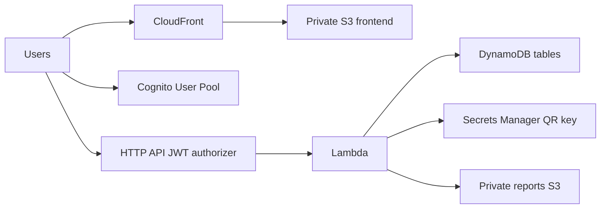
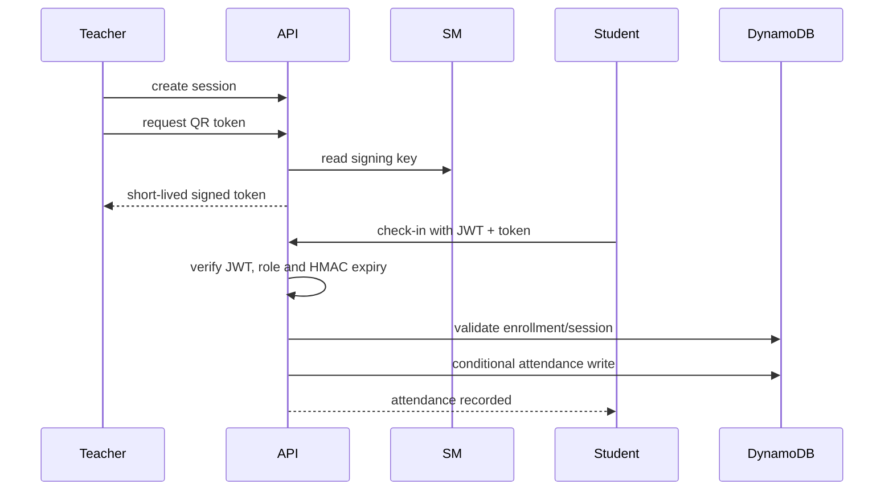

# Architecture

```mermaid
flowchart LR
U[Users]-->CF[CloudFront]-->S3[Private S3 frontend]
U-->C[Cognito User Pool]
U-->API[HTTP API JWT authorizer]-->L[Lambda]
L-->D[DynamoDB tables]
L-->SM[Secrets Manager QR key]
L-->R[Private reports S3]
```

```mermaid
sequenceDiagram
Teacher->>API: create session
Teacher->>API: request QR token
API->>SM: read signing key
API-->>Teacher: short-lived signed token
Student->>API: check-in with JWT + token
API->>API: verify JWT, role and HMAC expiry
API->>DynamoDB: validate enrollment/session
API->>DynamoDB: conditional attendance write
API-->>Student: attendance recorded
```

The browser never receives the HMAC key. API Gateway validates JWTs and Lambda enforces roles and course ownership again.
