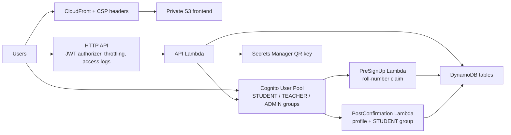
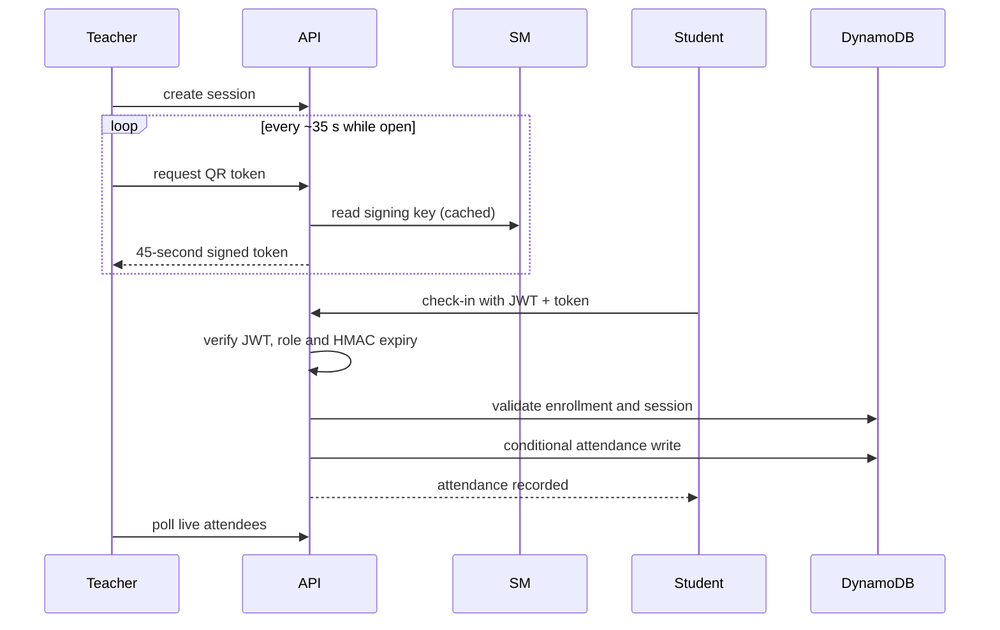

# Architecture

- The browser never receives the HMAC key. API Gateway validates JWTs, and the Lambda enforces roles and course ownership again.
- Users are in exactly one of `STUDENT` or `TEACHER`. `ADMIN` is an additional group, checked by `requireAdmin`. A role change removes and adds groups, updates `Users.role`, and globally signs the user out so the new groups take effect.
- The Cognito app client uses SRP only, prevents user-existence errors, and recovers accounts by email.
- PostConfirmation only acts on `PostConfirmation_ConfirmSignUp`, so a password reset never changes a user's groups.
- Reports are built in the Lambda and returned inline as JSON or CSV; no report bucket exists.

## Local mode

`npm run dev:local` runs `apps/api/src/local-server.ts`, a Node HTTP server that wraps the same `route()` function with the in-memory store and a fake user directory. It is paired with the web app's local auth adapter. Both exist only in `vite --mode demo|e2e`; the production bundle contains neither, which a CI step checks. Playwright runs against this mode.
